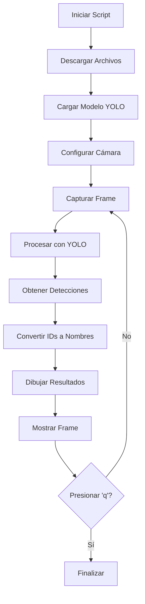

# 🔍 YOLO Real-time Object Detection

Sistema de detección de objetos en tiempo real usando diferentes versiones de YOLO (v4-v8) con descarga automática de configuraciones y pesos.

## 🚀 Características

- **Múltiples versiones YOLO**: Soporte para YOLOv4, v5, v6, v7 y v8
- **Descarga automática**: Archivos de configuración, pesos y clases se descargan automáticamente
- **Detección en tiempo real**: Procesamiento de cada fotograma de la cámara web
- **Configuración flexible**: Resolución, umbral de confianza y versión personalizables
- **Interfaz interactiva**: Controles por teclado y información en pantalla

## 📁 Archivos del Proyecto

```
tarea-2/
├── yolo_realtime.py     # Script principal
├── coco.names          # 80 nombres de clases COCO (descarga automática)
├── yolov4.cfg          # Configuración YOLOv4 (descarga automática)
├── yolov4.weights      # Pesos YOLOv4 (~250MB) (descarga automática)
├── yolov8n.pt          # Modelo YOLOv8 nano (descarga automática)
├── yolov9s.pt          # Modelo YOLOv9 small (descarga automática)
└── README.md           # Este archivo
```

## 🛠️ Instalación

### Dependencias
```bash
# Instalar usando uv (recomendado)
uv add opencv-python ultralytics requests numpy matplotlib argparse
```

### Ejecución
```bash
# YOLOv8 por defecto
uv run yolo_realtime.py

# O con Python directamente
python yolo_realtime.py
```

## 🎮 Uso del Script

### Opciones de Línea de Comandos

```bash
# Sintaxis básica
uv run yolo_realtime.py [opciones]

# Opciones disponibles:
--version, -v    Versión YOLO (4, 5, 6, 7, 8) [Por defecto: 8]
--confidence, -c Umbral de confianza (0.0-1.0) [Por defecto: 0.5]
--resolution, -r Resolución cámara (ej: 640x480) [Por defecto: 640x480]
--help, -h       Mostrar ayuda
```

### 📝 Ejemplos de Uso

```bash
# YOLOv8 con configuración por defecto
uv run yolo_realtime.py

# YOLOv4 usando archivos .cfg y .weights
uv run yolo_realtime.py --version 4

# YOLOv7 con alta confianza y resolución HD
uv run yolo_realtime.py --version 7 --confidence 0.8 --resolution 1280x720

# YOLOv5 para detección sensible (baja confianza)
uv run yolo_realtime.py -v 5 -c 0.3 -r 800x600
```

## 🔧 Diferencias entre Versiones

### YOLOv4 (OpenCV DNN)
- **Archivos**: `yolov4.cfg` + `yolov4.weights` + `coco.names`
- **Backend**: OpenCV DNN (sin GPU por defecto)
- **Ventajas**: Configuración nativa Darknet, menor uso de memoria
- **Uso**: Ideal para sistemas con recursos limitados

### YOLOv5-v8 (Ultralytics)
- **Archivos**: Modelos `.pt` (se descargan automáticamente)
- **Backend**: PyTorch con Ultralytics
- **Ventajas**: Mayor precisión, mejor API, soporte GPU
- **Uso**: Recomendado para mejor rendimiento y características modernas

## 📊 Funcionalidades Implementadas

### ✅ Descargas Automáticas
- **coco.names**: 80 clases de objetos del dataset COCO
- **yolov4.cfg**: Configuración de arquitectura de red YOLOv4
- **yolov4.weights**: Pesos entrenados YOLOv4 (~250MB)
- **Modelos .pt**: YOLOv5-v8 se descargan vía Ultralytics

### ✅ Procesamiento de Fotogramas
- Detección en cada frame de video en tiempo real
- Visualización de cajas delimitadoras y etiquetas
- Conteo de detecciones y objetos identificados
- Información de rendimiento (FPS, tiempo de inferencia)

### ✅ Interfaz de Usuario
```
Controles de Teclado:
'q' - Salir del programa
'i' - Mostrar información detallada en consola
```

### ✅ Información en Pantalla
- Número total de detecciones
- Nombres de objetos detectados (hasta 3)
- Versión YOLO en uso
- FPS y tiempo de inferencia (solo YOLOv4)

## 🗂️ Descripción de Archivos

### `coco.names`
```
Contiene los 80 nombres de clases del dataset COCO:
- Línea 0: "person"
- Línea 1: "bicycle"
- Línea 2: "car"
- ...
- Línea 79: "toothbrush"

Uso: Convierte IDs numéricos (0-79) a nombres legibles
```

### `yolov4.cfg`
```
Archivo de configuración que define:
- Arquitectura de la red neuronal
- Tamaños de capas y conexiones
- Parámetros de entrenamiento
- Configuración de anclas (anchors)

Formato: Texto plano con secciones [net], [convolutional], etc.
```

### `yolov4.weights`
```
Archivo binario que contiene:
- Pesos entrenados de todas las capas
- Parámetros de batch normalization
- Información de arquitectura
- ~250MB de datos entrenados en COCO dataset

Formato: Binario específico de Darknet
```

## 🔄 Flujo de Detección



## 🎯 Mapeo de Clases COCO

El archivo `coco.names` mapea los IDs de detección a nombres comprensibles:

| ID | Clase | Categoría |
|----|--------|-----------|
| 0 | person | Personas |
| 1-8 | bicycle, car, motorbike, aeroplane, bus, train, truck, boat | Vehículos |
| 9-13 | traffic light, fire hydrant, stop sign, parking meter, bench | Urbano |
| 14-23 | bird, cat, dog, horse, sheep, cow, elephant, bear, zebra, giraffe | Animales |
| 24-30 | backpack, umbrella, handbag, tie, suitcase, frisbee, skis | Accesorios |
| ... | ... | ... |
| 70-79 | oven, toaster, sink, refrigerator, book, clock, vase, scissors, teddy bear, hair drier, toothbrush | Hogar |

## 🚨 Solución de Problemas

### Error: "No se pudo acceder a la cámara"
```bash
# Verificar cámaras disponibles
ls /dev/video*

# Probar diferentes índices
# Modificar cv2.VideoCapture(0) por cv2.VideoCapture(1) en el script
```

### Error: "No such file or directory: yolov4.weights"
```bash
# El archivo se descarga automáticamente, verificar conexión a internet
# O descargar manualmente:
curl -L -O https://github.com/AlexeyAB/darknet/releases/download/darknet_yolo_v3_optimal/yolov4.weights
```

### Rendimiento lento
```bash
# Usar resolución menor
uv run yolo_realtime.py --resolution 320x240

# Aumentar umbral de confianza
uv run yolo_realtime.py --confidence 0.7

# Usar versión más rápida
uv run yolo_realtime.py --version 8  # YOLOv8 es más eficiente
```

## 🔗 Referencias

- [Ultralytics YOLO](https://github.com/ultralytics/ultralytics)
- [Darknet YOLO](https://github.com/pjreddie/darknet)
- [COCO Dataset](https://cocodataset.org/)
- [OpenCV DNN Module](https://docs.opencv.org/4.x/d2/d58/tutorial_table_of_content_dnn.html)

## 📄 Licencia

Este proyecto es para fines educativos. Los modelos YOLO y dataset COCO tienen sus respectivas licencias.

---
**Desarrollado para el curso de Computer Vision - Tarea 2**